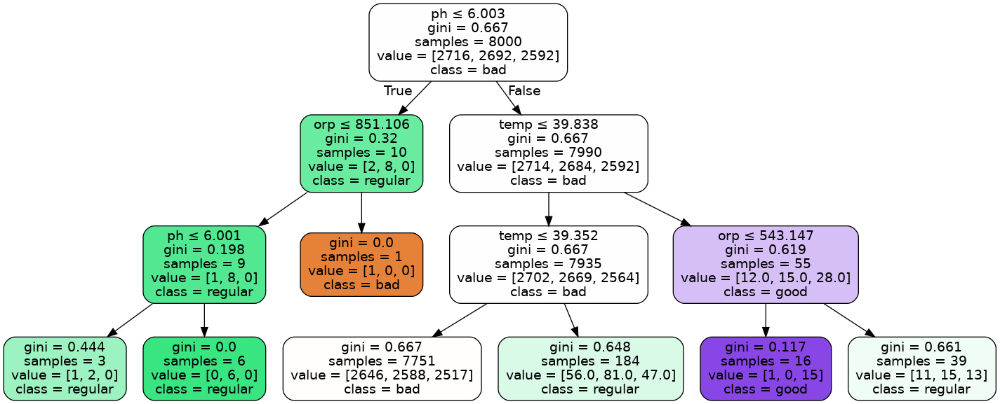

# AI (PREDICTIVE MODEL)

We have different metrics that are obtained through the sensors. These metrics are: Temperature, ORP (Oxidation Reduction Potential) and PH. Other metrics such as chlorine and water quality are calculated by two predictive models (artificial intelligence), namely a regression model and a decision tree model. The data scientist is in charge of downloading the samples that the user has been adding based on the information from the sensors, and using a series of python scripts, generates the model and uploads it to the system. This model is in responsible for making the on-demand predictions requested by the user.

## Preparing the environment

```shell
cd swpc/ai
```

```shell
python3 -m venv .venv/swpc_fit
source .venv/swpc_fit/bin/activate
pip install -r requirement_fit.yml
```

## Generate a model with samples for test purposes.

```shell
cd swpc/ai
```

```shell
mkdir model
source .venv/swpc_fit/bin/activate
```
### Generate samples 

```shell
python3 main.py sample -s=10000 -r=model/samples.dat
```

### Fitting the model for water quality and chlorine

```shell
python3 main.py fit -s=model/samples.dat -t=model/tree -m=model/model
```

### Decision tree for water quality obtained from the model fitted on the samples.



## Generate a model with real samples

```shell
cd swpc/ai
```

```shell
mkdir model
source .venv/swpc_fit/bin/activate
```

### Download samples

The samples are stored in aws dynamodb. Export the database to a local file.

### Fitting the model for water quality and chlorine

The file samples.dat is the exported file with all samples.

```shell
python3 main.py fit -s=model/samples.dat -t=model/tree -m=model/model
```
