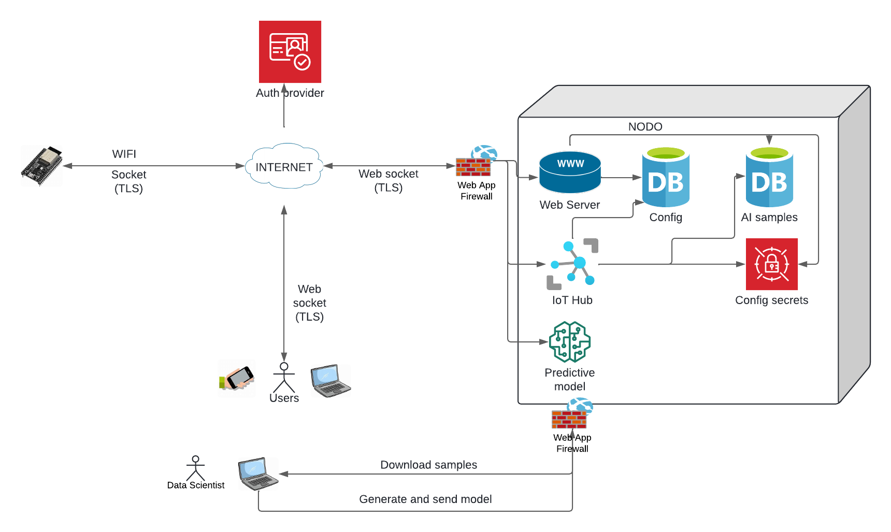

# ARCHITECTURE

The system is composed of the following main components:

- [Board controller](../micro/swpc/swpc.ino): It is responsible for the collection of metrics through the sensors and their subsequent sending. The controller is governed by events managed by the server through the ioT Hub component. The transmission of information is sent knowing the following parameters, sent by the server and configured by the user.

  - Wakeup: The micro-controller in charge of measuring the swimming pool values can consume quite a lot of battery power. To save the battery, it is convenient to configure the hours of emission of the metrics by the micro-controller. Wakeup configures how many minutes the micro-controller wakes up and checks between which hours it will emit the metrics. Once the micro-controller has woken up, the controller is managed through the events governed by the server.
  - IniSendTime and EndSendTime: Configures between which hours the values will be emitted.
  - Buffer: Configures how many seconds the micro stores the metrics before sending them. 

  The communication between the micro and the hub is done through websocket with low latency, secure (security token and TLS) and bidirectional communication. The system is able to recover even with  micro-cuts and restarts of the micro-controller itself, very typical in this type of devices and topologies. 

- [ioT Hub](../pkg/iot/hub.go): The hub primarily manages real-time transmission between the device and the clients and vice versa. The hub can cover a single device and hundreds of clients with very few resources. This component can be used independently, allowing not only the transmission of metrics for a pool, also for any other environment. The hub is able to transfer metrics using low latency websocket, using events. The system allows reporting the status of the device to each of the subscribers (clients), as well as any errors that arise in the system. As mentioned above, the transmission can be done by configuring a time window.

- [Web Server](../internal/web): The web server is composed of several main sub-components:
  - [Authentication](../internal/web/auth.go): Controls user authentication using oauth2 through authentication providers. The default provider used by default is [AWS Cognito](https://aws.amazon.com/es/cognito/)
  - API: We have different APIs for managing [user configuration](../internal/web/config.go), [samples for prediction](../internal/web/sample.go) and [IA preditions](../internal/web/prediction.go).

- [Configuration module](../internal/config/config.go): Allows the system to be configured via a *SW_POOL_CONTROLLER_CONFIG* json environment variable. Secrets located in the configuration can be secured through provider services via the [`type Secret interface`](../internal/config/config.go) interface.

  > [!TIP]
  > If a secret is needed in the configuration, use an expression that satisfies: `@@[a-zA-Z0-9_]+`.

The default provider is [AWS Secrets Manager](https://aws.amazon.com/es/secrets-manager/). It is also possible to configure the [transmission parameters](../ui/src/config/config.tsx) by the user, as we saw earlier.

- [AI Preditions](../ai/): We have different metrics that are obtained through the sensors. These metrics are: Temperature, ORP (Oxidation Reduction Potential) and PH. Other metrics such as chlorine and water quality are calculated by two predictive models (artificial intelligence), namely a regression model and a decision tree model. The data scientist is in charge of downloading the samples that the user has been adding based on the information from the sensors, and using a series of python scripts, generates the model and uploads it to the system. This model is in responsible for making the on-demand predictions requested by the user.

- [User interface](../ui/src/): This is made up of several main modules:
  - [Dashboard](../ui/src/dashboard/): It displays the metrics, both those obtained with the sensors and those obtained by prediction.
  - [Configuration](../ui/src/config/): Allows you to configure the transmission parameters.
  - [Net](../ui/src/net/): Manages all communications, both REST and websocket.
  - [Auth](../ui/src/auth/): Manages authentication.
  - [AI](../ui/src/ai/): This is the module that allows samples to be added for model generation. It can be deactivated when the samples are completed.