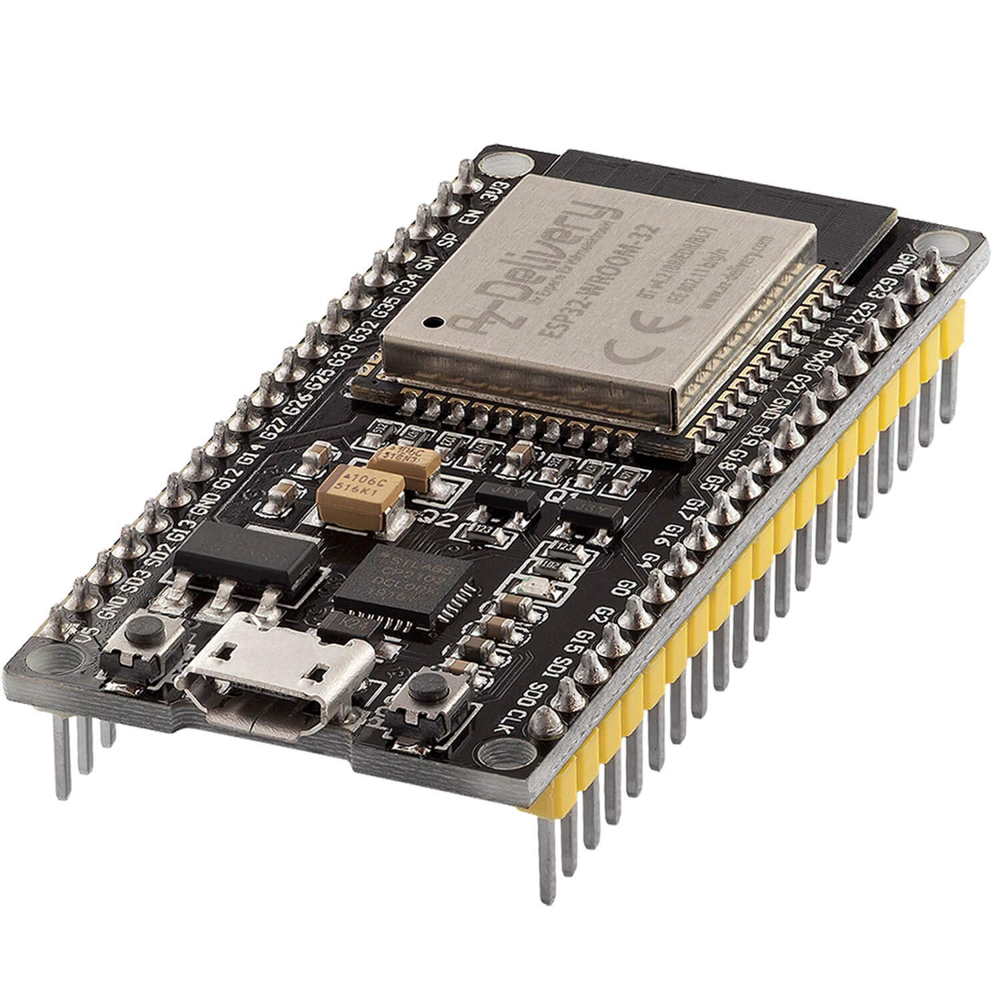
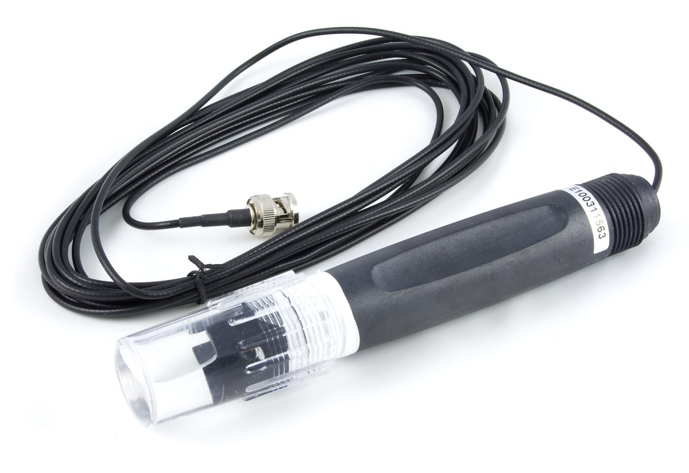
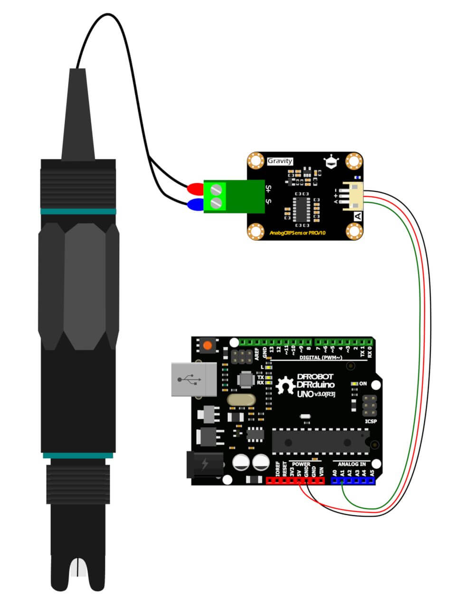
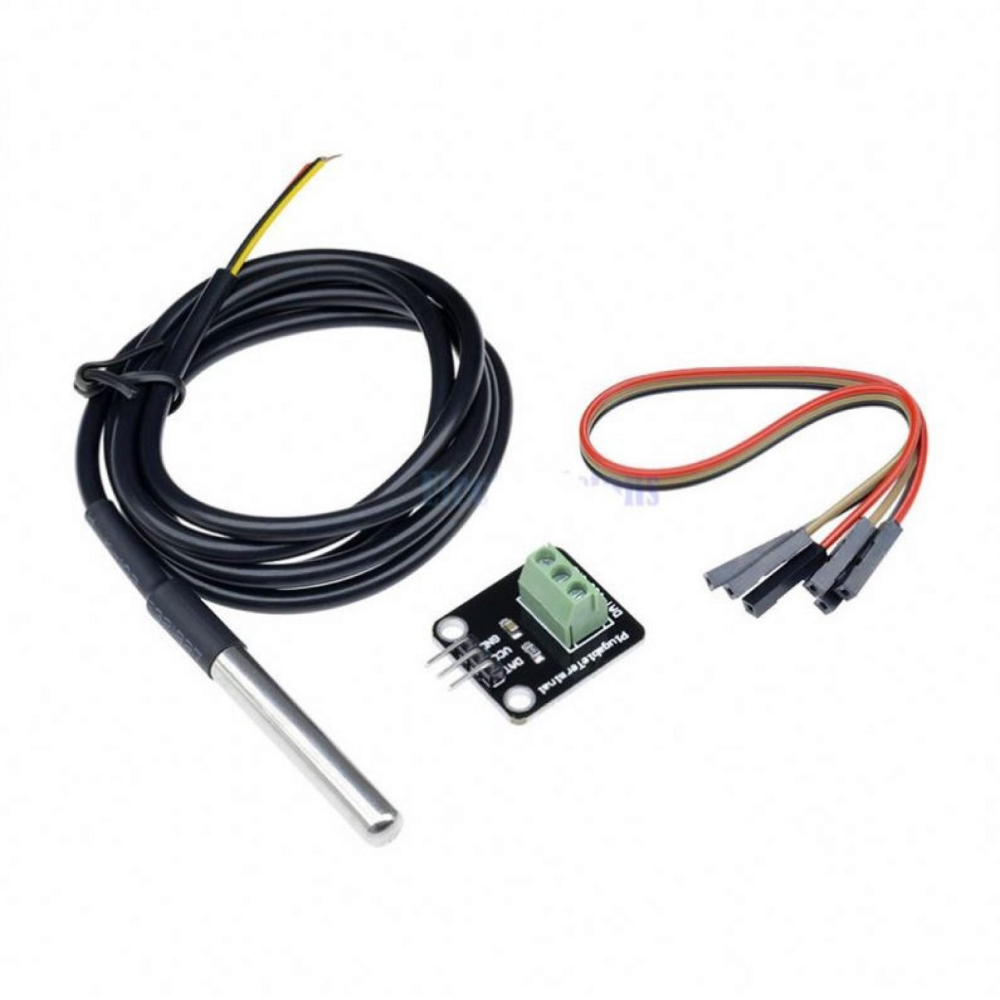
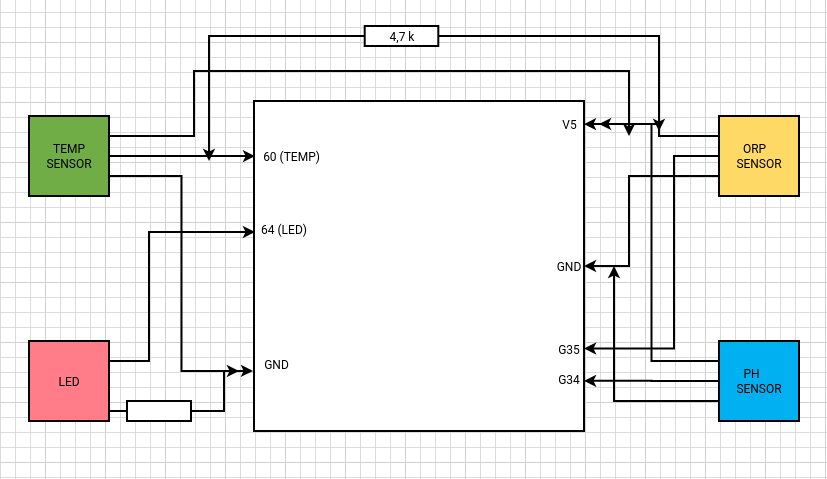
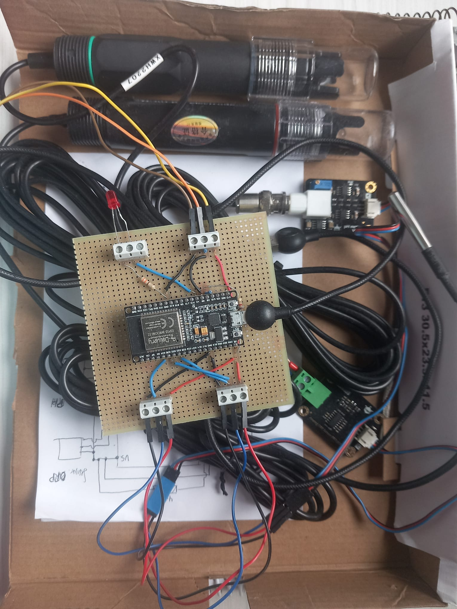

# ESP-32 DEV KIT C V2 (AZ- DELIVERY)

The ESP32 WROOM-32 series of Wi-Fi chips is manufactured by Espressif Systems
manufactured. The ESP32 WROOM-32 is a low-cost Wi-Fi module that is suitable for suitable for DIY projects in the Internet of Things (IoT) sector. This
module comes with many GPIOs and supports a variety of protocols such as SPI, I2C, I2S, UART and more. The best thing about it is that it is equipped with a wireless network, which sets it apart from other microcontrollers such as the microcontroller. This means that it can remotely control and monitor devices via Wi-Fi and Bluetooth®. 

The ESP32 WROOM 32 is a system-on-chip (SoC) that utilises a 32-bit Tensilica microcontroller, antenna switch, digital RF balun, standard peripheral interfaces, power amplifier, low-noise amplifiers, filters and power management modules in a small housing. It offers 2.4GHz Wi-Fi (802.11 b/g/n,
supports speeds of up to 150MB/s), BLE and classic Bluetooth Bluetooth® wireless communication, 34 I/O pins, I2C and I2S interfaces, ADC (analogue-to-digital conversion), DAC (digital-to-analogue conversion), one SPI interface, UART on dedicated pins and PWM (pulse width modulation).

The processor core of Espressif, called LX6, is based on the Xtensa®
dual-core 32-bit LX6 processor controller and runs in the frequency range
from 80-240MHz. It has a 448kB boot ROM, 520kB on-chip SRAM and 4MB external flash memory.

# SENSORS

## H-101 pH electrode

This pH combination electrode is made of a sensitive glass membrane with low impedance. DFRobot Industrial pH Electrode - Armor Casing can be used in a variety of PH measurements with fast response, good thermal stability. It has good reproducibility, difficult to hydrolysis, and basically eliminates the alkali error. In the 0 to 14pH range, the output voltage of the electrode is linear. The reference system which consists of the Ag/AgCl gel electrolyte salt bridge has a stable half-cell potential and excellent anti-pollution performance. The ring PTFE membrane is not easy to be clogged, so the electrode is suitable for long-term online detection.

## Gravity: Analog Industrial ORP Sensor Meter Pro 

As an upgraded version of Industrial Gravity: ORP Sensor Meter for Arduino, this new generation ORP probe employs platinum indicator electrode and silver-silver chloride reference electrode, which makes it available for 24-hour online ORP monitoring and greatly enhances product durability.

The new signal converter adds a more stable voltage reference so that the sensor readings would be no longer affected by supply voltage fluctuations. Besides, there are screws, copper columns and waterproof connectors included in the accessory packet to help you conveniently build up ORP monitoring system.

ORP(Oxidation-Reduction Potential) is a measure of the ability of oxidation and reduction of an aqueous solution, which the relative degree of oxidizing or reducing. The unit is mV.

If the oxidation reduction potential is high then chemical oxidation is strong , while if the potential is lower then oxidation is weaker.

The positive potential means that solution shows a certain degree of oxidation, while the negative potential means that solution shows a certain degree of reduction. ORP is an important index of water quality detection, although it can not separate water quality independently, it can be combined with other water quality indexes to reflect the ecological environment better. 

## Temperature sensor module

Submersible temperature probe, based on the DS18B20 digital 

# BOARD SCHEMA

# FINAL DEVICE (SCREENSHOT)

