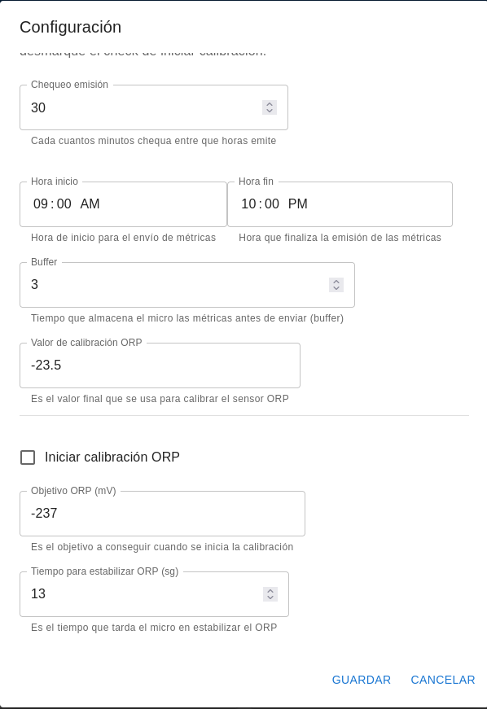

# ORP CALIBRATION

The ORP sensor can become unstable over time. The sensor materials degrade and calibration is required from time to time.

The system provides a function to calibrate the sensor that is initiated from the web user interface.

Simply insert the sensor into a solution with a fixed ORP and start the calibration to obtain the offset value.

When we start the ORP sensor calibration, the micro puts itself in calibration mode and tries to achieve the target we have set, during the stabilization time.

It is advisable to allow a few minutes for the sensor to stabilize before starting the calibration.

The calibration value is displayed in the web interface, in the ORP indicator. Once the calibration has stabilized, type this value in the ORP calibration field and uncheck the start calibration checkbox.
